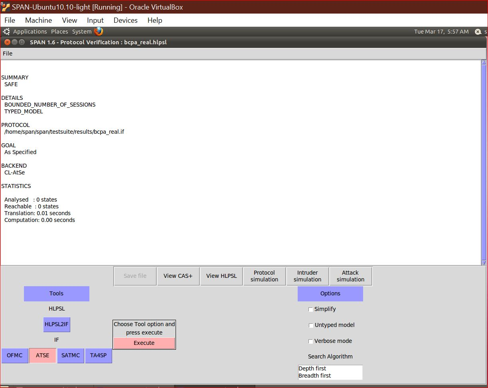

 # BCPA — Blockchain-Based Cross-Domain Privacy-Preserving Authentication

> **Paper:** Wang et al., *"BCPA: A Blockchain-Based Cross-Domain Privacy-Preserving Authentication Scheme in Internet of Things Environments"*  
> **Journal:** IEEE Internet of Things Journal, Vol. 12, No. 22, November 2025  
> **DOI:** [10.1109/JIOT.2025.3601211](https://doi.org/10.1109/JIOT.2025.3601211)

---

## 📌 What is BCPA?

BCPA solves a core IoT security problem — how can a user registered in **Domain A** authenticate in **Domain B** without re-registering, without revealing their real identity, and without relying on any trusted third party?

The solution combines **4 technologies**:

| Technology | Purpose |
|---|---|
| FCFF (Fuzzy Commitment Feature Fusion) | Fuses fingerprint + PUF hardware into one unforgeable key |
| ECC (Elliptic Curve Cryptography) | Pairing-free anonymous authentication |
| Consortium Blockchain + Smart Contracts | Decentralized tamper-proof registry |
| ECDH (Elliptic Curve Diffie-Hellman) | Lightweight session key agreement |

---

## 🏗️ System Architecture

```
┌─────────┐     Register      ┌─────────────────────┐
│   AO    │ ─────────────────▶│  Consortium         │
│(Authority│                  │  Blockchain (CB)    │
│  Org.)  │ ◀─────────────── │  - Stores PIDu, Pu  │
└─────────┘   Query/Update    │  - Stores PIDn, Pn  │
     │                        └─────────────────────┘
     │ Register                         ▲
     ▼                                  │ Query
┌─────────┐    Login     ┌──────────────┴──┐
│   EU    │ ────────────▶│      DN         │
│(End User│              │ (Domain Node)   │
│ Mobile) │              └────────────────┘
└─────────┘                      │
                                 │ Auth
                          ┌──────▼──────┐
                          │     ED      │
                          │(End Device) │
                          │IoT Sensor   │
                          └─────────────┘
```

---

## 🧪 Experiments Reproduced

### Experiment 1 — AVISPA Formal Security Verification (Figure 8)

**Tool:** AVISPA + SPAN Virtual Machine in VirtualBox  
**Model:** HLPSL (High-Level Protocol Specification Language)  
**Intruder Model:** Dolev-Yao — attacker controls entire network

| Backend | Our Result | Paper Result |
|---|---|---|
| OFMC | ✅ SAFE | ✅ SAFE |
| CL-AtSe | ✅ SAFE | ✅ SAFE |




---

### Experiment 2 — Smart Contract GAS Cost (Table VII)

**Tools:** Ganache Desktop + Remix IDE  
**Language:** Solidity 0.8.19  
**Network:** Local Ethereum (HTTP://127.0.0.1:7545)

The REG smart contract implements 4 algorithms from the paper:
- **Algorithm 1:** Constructor — initializes registry
- **Algorithm 2:** insertReg() — registers EU/DN on blockchain
- **Algorithm 3:** retrieveReg() — queries public key by pseudonym
- **Algorithm 4:** disableReg() — revokes identity (sets TAG=False)

| Operation | Our GAS | Paper GAS (Table VII) |
|---|---|---|
| Deploy Contract | 883,367 | 4,950,988 |
| insertReg() | 208,185 | 376,258 |
| retrieveReg() | View only | 497,333 |
| disableReg() | 32,754 | — |


---

### Experiment 3 — Computational Cost (Table V, Figure 9)

Authors used **MIRACL C++ library** on Intel i7-9600 @ 3GHz with 1000 iterations.

| Scheme | EU Time (ms) | DN Time (ms) |
|---|---|---|
| Xie[10] | 3.648 | 3.423 |
| Jia[17] | 3.153 | 1.900 |
| Zhang[19] | 3.320 | 1.792 |
| Irshad[21] | 7.965 | 7.690 |
| **BCPA (Ours)** | **3.484** | **2.918** |

**BCPA formula:**
```
EU = 8*Th + 4*Tm + Ta + TFE = 8(0.055) + 4(0.674) + 0.002 + 0.274 = 3.484 ms
DN = 4*Th + 4*Tm + Ta       = 4(0.055) + 4(0.674) + 0.002         = 2.918 ms
```

---

### Experiment 4 — Communication Cost (Table VI, Figure 10)

Parameters: |G|=512b, |Zn|=256b, |H|=256b, |ID|=128b, |TS|=32b

| Scheme | Total Bits | Rounds |
|---|---|---|
| Xie[10] | 3296 | 3 |
| Jia[17] | 1984 | 2 |
| Zhang[19] | 1856 | 2 |
| Irshad[21] | 2944 | 3 |
| **BCPA** | **2112** | **2** |

**BCPA formula:** `2|G| + |Zn| + |H| + 2|ID| + 2|TS| = 2112 bits`

---

### Experiment 5 — Scalability (Figures 11 & 12)

- All schemes scale **linearly** with number of domains/users
- BCPA has **lower slope** than Xie[10] and Irshad[21]
- At 60 domains: BCPA = 383ms vs Irshad = 813ms (**2.1x faster**)

---

## 📁 Repository Structure

```
BCPA-Paper-Implementation/
├── README.md                    ← This file
├── avispa/
│   └── bcpa_real.hlpsl          ← HLPSL model for AVISPA verification
├── smart-contract/
│   └── REG.sol                  ← Solidity smart contract (Algorithms 1-4)
├── presentation/
│   └── BCPA_Presentation.pptx  ← Complete implementation presentation
└── results/
    ├── avispa_ofmc.png          ← AVISPA OFMC result screenshot
    ├── avispa_clatse.png        ← AVISPA CL-AtSe result screenshot
    ├── ganache_result.png       ← Ganache transaction screenshot
    └── remix_result.png         ← Remix deployment screenshot
```

---

## 🛠️ Tools Used

| Tool | Version | Purpose |
|---|---|---|
| AVISPA + SPAN VM | 1.6 | Formal security verification |
| Ganache Desktop | Latest | Local Ethereum blockchain |
| Remix IDE | 1.5.1 | Solidity smart contract IDE |
| Solidity | 0.8.19 | Smart contract language |
| Python | 3.10+ | Benchmark calculations |
| VirtualBox + Ubuntu | Latest | Run SPAN VM |

---

## 🔑 Key Results

- ✅ **AVISPA:** BCPA is formally SAFE under Dolev-Yao intruder model
- ✅ **Smart Contract:** All 4 algorithms deployed and tested on Ganache
- ✅ **Speed:** BCPA is 2.3x faster than Irshad[21] (no bilinear pairing)
- ✅ **Communication:** Only 2112 bits in 2 rounds — efficient for IoT
- ✅ **Scalability:** Linear growth — suitable for large IoT deployments

---

## 📚 Reference

```
Wang et al., "BCPA: A Blockchain-Based Cross-Domain Privacy-Preserving 
Authentication Scheme in Internet of Things Environments," 
IEEE Internet of Things Journal, Vol. 12, No. 22, pp. 1-15, November 2025.
DOI: 10.1109/JIOT.2025.3601211
```